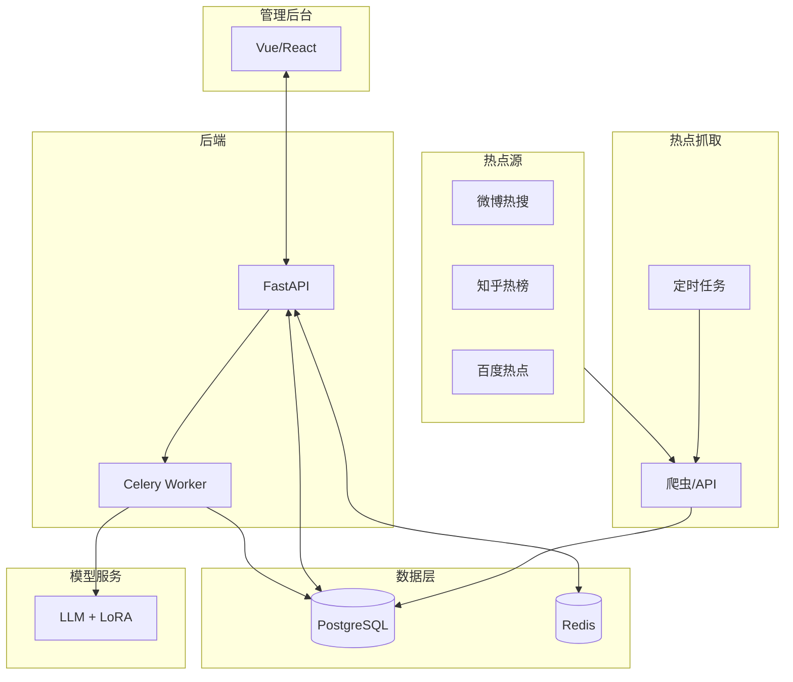

# ArticleGenerator 半自动化内容创作辅助系统 - 开发计划

## 一、项目概述

### 1.1 核心功能

- **热点自动抓取**：定时从各行业（科技、娱乐、财经等）获取热点，并按热度排序
- **人工热点选择**：管理后台展示热点列表，运营人员选择感兴趣的热点触发文章生成
- **智能文章生成**：基于选中热点，利用本地部署大语言模型生成符合账号风格的文章（支持多账号多风格）
- **人工评审与微调**：生成文章进入待评审列表，运营人员可阅读、通过、拒绝，或输入关键词对文章进行微调（重新生成部分内容）
- **人工发布辅助**：评审通过的文章进入待发布列表，运营人员可一键复制全文，自行粘贴发布到各平台（公众号、小红书、百家号等），并在系统中标记已发布

### 1.2 成本控制

- 模型全部本地部署，通过 LoRA 微调实现多账号风格
- 管理后台轻量级开发，适合个人或小团队使用
- 量化（4bit）后单卡运行，显存需求约 4-5GB

---

## 二、技术选型

| 模块 | 技术方案 | 说明 |
|------|----------|------|
| 热点抓取 | Scrapy / Requests + BeautifulSoup / 免费 API（天行数据、聚合数据等） | 优先使用 API，自建爬虫需处理反爬；定时任务抓取 |
| 文章生成 | 开源 LLM：ChatGLM3-6B / Qwen-7B + LoRA 微调 | 量化（4bit）后单卡运行；每个账号一个 LoRA 适配器，共享基础模型 |
| 账号风格训练 | 自建风格数据集（每账号 50+ 范例），LoRA 微调 | 训练时冻结基础模型，仅更新少量参数 |
| 微调（二次编辑） | 基于 Prompt 工程：用户输入关键词，模型对指定段落或全文重写 | 简单实现，无需额外训练 |
| 管理后台 | 前端：Vue.js / React + Element UI；后端：FastAPI / Django REST | 提供热点选择、文章评审、微调、发布辅助界面 |
| 数据库 | PostgreSQL / MySQL + Redis | 存储热点、文章、账号、风格、操作日志等；Redis 用于缓存和任务队列 |
| 任务调度 | Celery + Redis / APScheduler | 处理异步生成任务（避免阻塞） |
| 模型服务 | FastAPI 封装模型推理接口，支持动态加载 LoRA | 提供生成和微调接口 |
| 部署环境 | Docker + Docker Compose | 统一封装所有服务，便于迁移 |

---

## 三、系统架构

### 3.1 架构图

### 3.2 数据流

1. **热点抓取**：定时任务从各源抓取热点 → 去重后存入热点表，状态「未选择」
2. **热点选择**：运营人员在管理后台多选热点 → 选择账号风格 → 触发生成任务
3. **文章生成**：Celery 消费任务 → 调用模型服务（加载对应 LoRA）→ 生成文章存入文章表，状态「待评审」
4. **评审与微调**：运营人员查看文章 → 通过/拒绝，或输入关键词触发微调（全文重写）
5. **发布辅助**：已通过文章进入待发布列表 → 一键复制全文 → 人工粘贴发布 → 标记已发布

### 3.3 模型服务接口

- **`/generate`**：接收热点标题、账号 ID，加载对应 LoRA，生成文章
- **`/refine`**：接收文章 ID 和修改关键词，重新生成（可指定修改段落或全文重写）

---

## 四、数据库设计概要

### 4.1 热点表（hotspots）

| 字段 | 类型 | 说明 |
|------|------|------|
| id | PK | 主键 |
| title | VARCHAR | 热点标题 |
| source | VARCHAR | 来源（微博/知乎/百度等） |
| heat | INT | 热度值 |
| summary | TEXT | 摘要（可选） |
| url | VARCHAR | 链接 |
| status | ENUM | 未选择/已选择/已生成 |
| created_at | DATETIME | 创建时间 |

### 4.2 文章表（articles）

| 字段 | 类型 | 说明 |
|------|------|------|
| id | PK | 主键 |
| hotspot_id | FK | 关联热点 |
| account_id | FK | 关联账号 |
| content | TEXT | 文章内容 |
| status | ENUM | 待评审/已通过/已拒绝/已发布 |
| refine_history | JSON | 微调记录（可选） |
| created_at | DATETIME | 创建时间 |
| updated_at | DATETIME | 更新时间 |

### 4.3 账号风格表（accounts）

| 字段 | 类型 | 说明 |
|------|------|------|
| id | PK | 主键 |
| platform | VARCHAR | 平台（公众号/小红书等） |
| account_name | VARCHAR | 账号名 |
| lora_path | VARCHAR | LoRA 权重路径 |
| sample_articles | JSON/TEXT | 示例文章（可选） |
| created_at | DATETIME | 创建时间 |

### 4.4 热点源配置表（hotspot_sources）

| 字段 | 类型 | 说明 |
|------|------|------|
| id | PK | 主键 |
| name | VARCHAR | 源名称 |
| type | VARCHAR | API/爬虫 |
| config | JSON | 配置（API Key、URL 等） |
| enabled | BOOLEAN | 是否启用 |

---

## 五、八阶段开发计划（8-10 周）

### 阶段 1：需求细化与技术调研（1 周）

- 确认行业分类及热点源列表（微博热搜、知乎热榜、百度热点等）
- 调研各平台发布限制（公众号、小红书、百家号 API 情况），确定无需自动发布，只需复制辅助
- 选定基础模型（推荐 ChatGLM3-6B-4bit 量化），测试本地推理速度（预计生成一篇文章 30-60 秒）
- 确定风格训练方案：每账号收集至少 50 篇范例文章，设计 LoRA 微调流程

### 阶段 2：基础框架搭建（1 周）

- 搭建后端框架（FastAPI + SQLAlchemy + Celery），集成数据库
- 实现账号管理模块：增删改查账号，关联风格（存储 LoRA 路径）
- 实现热点源配置管理（可动态添加/修改抓取源）
- 部署基础模型服务（HTTP 接口封装），验证生成接口

### 阶段 3：热点抓取模块开发（1 周）

- 开发爬虫或集成 API，解析热点标题、摘要、热度、链接等
- 实现去重（基于标题相似度或 URL），存储到热点表，初始状态「未处理」
- 定时任务（如每小时执行）更新热点列表

### 阶段 4：管理后台前端开发（2 周）

- 搭建 Vue/React 项目，实现基础布局和路由
- **热点列表页**：展示热点表格，按热度/时间排序，关键词搜索；多选 + 批量生成；弹窗选择账号风格
- **文章评审页**：分页展示待评审文章；查看全文、通过/拒绝；微调功能（输入关键词，异步重写）
- **待发布页**：展示已通过文章；复制全文、标记已发布
- 用户登录/权限管理（可选）

### 阶段 5：文章生成与微调模块开发（2 周）

- **风格训练**：收集范例文章，构建训练数据集，使用 LoRA 微调，保存权重并记录到数据库
- **生成接口**：接收热点标题和账号 ID，加载 LoRA，构造 Prompt，调用模型生成，存储到数据库
- **微调接口**：接收文章 ID 和修改关键词，构造 Prompt（原文 + 关键词），全文重写，更新文章内容

### 阶段 6：后端 API 与任务集成（1 周）

- 开发热点选择、触发生成的 API：接收热点 ID 列表和账号 ID，创建多个 Celery 任务
- 开发文章评审 API：更新文章状态（通过/拒绝）
- 开发待发布文章列表 API
- 配置 Celery worker，确保生成任务在后台执行

### 阶段 7：集成与测试（1 周）

- 联调所有模块：抓取 → 热点选择 → 生成 → 评审 → 微调 → 发布辅助全流程
- 测试并发生成，优化数据库连接和模型并发（使用锁或队列）
- 编写自动化测试（API 单元测试）
- 用户验收测试，收集反馈调整 UI/UX

### 阶段 8：部署与运维（1 周）

- 编写 Dockerfile 和 docker-compose.yml：数据库、Redis、模型服务、主应用、Celery worker
- 配置环境变量，设置定时抓取（cron 或 Celery beat）
- 部署到云服务器或本地，配置日志监控
- 成本优化：模型服务可单独运行在 GPU 实例，其他服务运行在低配实例

---

## 六、关键实现要点

### 6.1 热点排序与多选批量生成

- 抓取时记录热度值，后台默认按热度降序
- 支持时间筛选（今日、本周）
- 多选批量生成，避免逐个操作

### 6.2 微调功能

- 简化实现：微调即全文重写，Prompt 包含原文和用户关键词
- 可选：保存每次修改版本，便于回溯

### 6.3 发布辅助

- 复制全文：前端使用 `navigator.clipboard.writeText`
- 标记已发布：更新文章状态，记录发布时间

### 6.4 多账号 LoRA

- 每个账号一个 LoRA 适配器，生成时根据账号 ID 动态加载
- 使用 `peft` 库的 `set_adapter` 或重新加载模型
- 并发高时可预先加载多个 LoRA 到内存，通过切换实现

### 6.5 成本控制

- 模型量化：GPTQ 或 AWQ 4bit，显存约 4-5GB
- 训练：使用 AutoDL 等按需实例，训练完下载权重，本地推理
- 本地 GPU（如 RTX 3060 12G）可完全本地运行，零云成本

---

## 七、风险与应对

| 风险 | 应对措施 |
|------|----------|
| 生成文章质量不稳定 | 提供人工评审和微调环节；优化 Prompt；积累数据后继续微调模型 |
| 微调功能效果不佳 | 采用简单重写策略，用户可多次尝试；后期可引入更精细的编辑方法（如 DiffEdit） |
| 并发生成导致模型服务过载 | 使用任务队列控制并发数；模型服务使用批处理；水平扩展多个模型实例 |
| 抓取被封 IP | 使用代理池、降低频率、优先使用 API |
| 人工操作繁琐 | 优化 UI 交互，如批量选择、批量通过、快捷键支持等 |
| 数据安全（账号信息等） | 敏感信息加密存储；管理后台设置访问密码；本地部署避免暴露公网 |

---

## 八、部署方案

- **本地部署**：适合有 GPU 的开发者，所有服务运行在一台机器上，通过内网访问管理后台
- **云端部署**：GPU 云服务器（如腾讯云 GN7 T4 卡）部署模型服务；轻量应用服务器部署数据库、后端、前端、Celery
- **混合部署**：模型训练在本地或按需实例，推理服务部署在云端低配 GPU；管理后台部署在低成本云主机

---

## 九、成本估算（月/元）

| 项目 | 配置/用量 | 成本 |
|------|-----------|------|
| GPU 云服务器 | 1 * T4 (16G 显存) / 竞价实例 | 500-800 |
| CPU 云服务器 | 2 核 4G（后端、数据库、队列） | 100-200 |
| 对象存储 | 少量数据备份（可选） | 0-50 |
| 域名 | 可选 | 0-100 |
| **总计** | | **600-1150** |

若本地部署，成本仅为电费。
